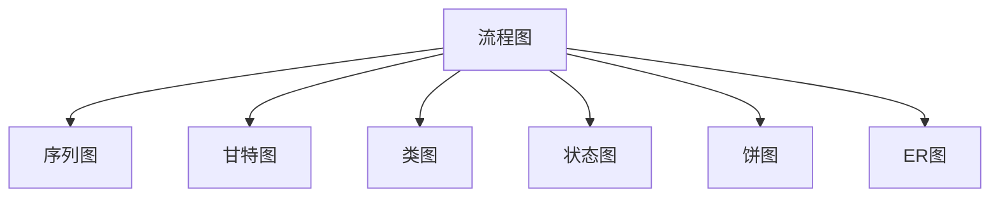

# MD Cat

一个将 Markdown 转换为微信公众号文章风格的工具，支持实时预览和多种主题风格。采用温馨的米白色设计，提供舒适的编辑体验。

## ✨ 功能特点

- 📝 **左右分屏编辑**：左侧编辑 Markdown 源码，右侧实时预览渲染效果
- 🎨 **多种主题风格**：支持 15+ 种主题风格，包括微信公众号、AI文章、读书笔记、GitHub、Notion、Typora 等
- 🔄 **实时预览**：编辑时即时查看渲染效果
- 📋 **多格式复制**：支持复制为公众号格式、HTML 格式、Markdown 格式
- 📊 **Mermaid 图表支持**：支持流程图、序列图、甘特图、类图、状态图等
- 🧮 **KaTeX 数学公式**：支持行内和块级数学公式渲染
- 💻 **代码高亮**：支持多种编程语言的语法高亮，带复制功能
- 🛡️ **XSS 保护**：使用 DOMPurify 确保内容安全
- 🛠️ **工具栏功能**：快速插入常用 Markdown 语法
- 📈 **实时统计**：显示字数、行数、阅读时间、最后保存时间
- 💾 **自动保存**：每 30 秒自动保存到本地存储
- ⌨️ **快捷键支持**：Ctrl+B/I/K/S 等常用快捷键
- 🎯 **易于扩展**：主题系统设计灵活，方便添加新主题
- ⚡ **纯前端实现**：基于 Vue3 + Vite，无需后端
- 🎨 **温馨界面**：米白色系设计，提供舒适的视觉体验

## 🛠️ 技术栈

- **Vue 3** - 渐进式 JavaScript 框架（Composition API）
- **Vite** - 下一代前端构建工具
- **Marked** - Markdown 解析器（v11）
- **Highlight.js** - 代码高亮（Atom One Dark 主题）
- **Mermaid** - 图表渲染引擎
- **KaTeX** - 数学公式渲染引擎
- **DOMPurify** - XSS 防护库

## 🚀 快速开始

### 安装依赖

```bash
npm install
```

### 开发运行

```bash
npm run dev
```

应用将在 `http://localhost:5173` 启动（Vite 默认端口）

### 构建生产版本

```bash
npm run build
```

构建产物将输出到 `dist` 目录

### 预览生产构建

```bash
npm run preview
```

## 📁 项目结构

```text
md-cat/
├── public/
│   ├── images/          # 静态图片资源
│   └── qrcodes/         # 二维码图片
├── src/
│   ├── components/
│   │   ├── MarkdownEditor.vue    # Markdown 编辑器组件
│   │   ├── MarkdownPreview.vue   # Markdown 预览组件
│   │   ├── Toolbar.vue           # 工具栏组件
│   │   ├── StatsBar.vue          # 统计信息组件
│   │   ├── ThemeSelector.vue     # 主题选择器组件
│   │   └── CopyButton.vue        # 复制按钮组件
│   ├── themes/
│   │   └── index.js              # 主题配置文件
│   ├── App.vue                    # 主应用组件
│   └── main.js                    # 应用入口
├── index.html                     # HTML 模板
├── vite.config.js                 # Vite 配置
├── package.json                   # 项目配置
└── README.md                      # 项目文档
```

## 🎨 支持的主题

### 亮色主题

- 📱 **微信公众号** - 适合微信公众号文章排版
- 🤖 **AI文章** - AI 生成文章风格，科技感十足
- 📚 **读书笔记** - 读书笔记风格，优雅阅读体验
- 📕 **小红书卡片** - 卡片式设计，渐变色标题
- 💻 **GitHub** - GitHub 风格，简洁专业
- 📝 **Notion** - Notion 风格，现代简洁
- ✍️ **Typora** - Typora 风格，优雅阅读
- 🎨 **Material** - Material Design 风格
- ✨ **Doocs 简约** - Doocs 简约风格，蓝色强调
- 🚀 **Doocs 科技** - Doocs 科技风格，紫色渐变
- 🎨 **Doocs 文艺** - Doocs 文艺风格，米色衬线
- 💼 **Doocs 商务** - Doocs 商务风格，黑白简洁
- 🍃 **Doocs 清新** - Doocs 清新风格，绿色系
- ☀️ **Doocs 温暖** - Doocs 温暖风格，橙红调
- ❄️ **Doocs 冷色** - Doocs 冷色风格，蓝色调

### 暗色主题

- 🌙 **暗色主题** - 护眼暗色模式
- 🧛 **Dracula** - Dracula 暗色主题

## 📖 使用说明

### 基本操作

1. 在左侧编辑器中输入 Markdown 内容
2. 右侧会实时显示渲染效果
3. 通过顶部下拉菜单切换不同的主题风格
4. 使用工具栏快速插入常用格式
5. 点击"复制"按钮可选择复制格式（公众号/HTML/Markdown）

### 支持的 Markdown 语法

- **基础语法**：标题（H1-H6）、粗体、斜体、删除线
- **列表**：有序列表、无序列表、嵌套列表
- **代码**：行内代码、代码块（带语法高亮和复制功能）
- **引用**：引用块
- **链接和图片**：链接、图片
- **表格**：Markdown 表格
- **分割线**：水平分割线

### Mermaid 图表

支持以下类型的 Mermaid 图表：



### 数学公式

**行内公式**：使用单个 `$` 包裹，例如：$E = mc^2$

**块级公式**：使用双 `$$` 包裹，例如：

$$
\int_0^\infty e^{-x} dx = 1
$$

### 快捷键

| 快捷键 | 功能 |
|:-------|:-----|
| Ctrl + B | 插入粗体 |
| Ctrl + I | 插入斜体 |
| Ctrl + K | 插入链接 |
| Ctrl + S | 保存内容 |
| Ctrl + Enter | 快速复制（公众号格式） |

### 自动保存

- 内容每 30 秒自动保存到浏览器本地存储
- 刷新页面后自动恢复上次编辑的内容和主题选择
- 可手动点击"保存"按钮立即保存

### 复制功能

支持三种复制格式：

- **公众号格式**：优化后的 HTML，适合直接粘贴到微信公众号编辑器
- **HTML 格式**：完整的 HTML 代码
- **MD 格式**：原始 Markdown 源码

## 🎨 界面设计

- **整体风格**：温馨的米白色系设计
- **模块区分**：编辑器区域和预览区域采用不同的背景色，便于区分
- **响应式设计**：适配不同屏幕尺寸
- **暗色模式支持**：部分主题支持暗色模式

## 🔧 添加新主题

1. 在 `src/themes/index.js` 中添加新主题配置

```javascript
export const themes = {
  // ... 现有主题
  newTheme: {
    label: '新主题名称',
    value: 'newTheme',
    type: 'light', // 或 'dark'
    icon: '🎨',
    description: '主题描述'
  }
}
```

2. 在 `src/components/MarkdownPreview.vue` 中添加对应的 CSS 样式

```css
.theme-newTheme :deep(h1) {
  /* 新主题的样式 */
}
```

## 📝 开发说明

#### 代码块功能

- 自动识别代码语言并显示标签
- 每个代码块都有独立的复制按钮
- 使用 Atom One Dark 主题进行高亮

##### 主题系统

- 主题配置与样式分离，易于维护
- 支持亮色和暗色两种类型
- 主题切换时自动保存用户选择

##### 数据持久化

- 使用 localStorage 保存编辑内容和主题选择
- 自动保存机制，防止数据丢失

## 📄 许可证

MIT

## 👤 作者

### 海边的小溪鱼

- GitHub: [@DuebassLei](https://github.com/DuebassLei)

- WeChat:


- 个人博客：[https://gaosanshi.dpdns.org](https://gaosanshi.dpdns.org)


## 🙏 致谢

- [Marked](https://github.com/markedjs/marked) - Markdown 解析器
- [Highlight.js](https://github.com/highlightjs/highlight.js) - 代码高亮
- [Mermaid](https://github.com/mermaid-js/mermaid) - 图表渲染
- [KaTeX](https://github.com/KaTeX/KaTeX) - 数学公式渲染
- [DOMPurify](https://github.com/cure53/DOMPurify) - XSS 防护
- [Doocs MD](https://github.com/doocs/md) - 部分主题参考

---

⭐ 如果这个项目对你有帮助，欢迎 Star！
## Star History

[](https://www.star-history.com/#DuebassLei/md-cat&type=date&legend=top-left)

