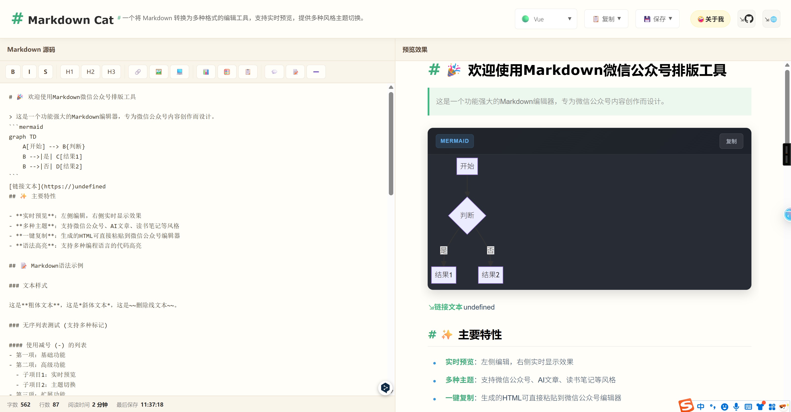
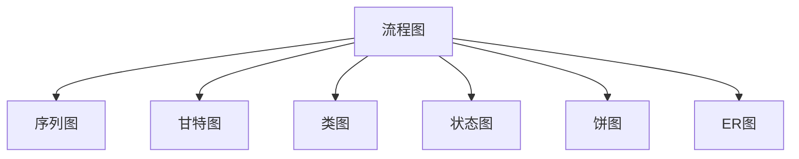

# MD Cat 🐱

> 一个优雅的 Markdown 编辑器，支持实时预览和 33+ 种精美主题风格

**MD Cat** 是一个功能强大的 Markdown 编辑工具，专为内容创作者设计。它提供了左右分屏的编辑体验，支持实时预览、多种主题切换、多格式导出等功能。无论是撰写技术文档、公众号文章，还是记录读书笔记，MD Cat 都能为你提供专业且舒适的写作体验。

## 🌟 核心特性

- 🎨 **33+ 精美主题**：涵盖亮色和暗色主题，包括微信公众号、GitHub、Notion、Typora、Ayu、Dracula 等风格
- ⚡ **实时预览**：左侧编辑，右侧即时渲染，所见即所得
- 📋 **多格式导出**：支持复制为公众号格式、HTML 格式、Markdown 格式
- 📊 **图表支持**：内置 Mermaid 图表引擎，支持流程图、序列图、甘特图、类图、状态图等
- 🧮 **数学公式**：基于 KaTeX 的数学公式渲染，支持行内和块级公式
- 💻 **代码高亮**：支持多种编程语言的语法高亮，每个代码块都有独立的复制按钮
- 💾 **自动保存**：每 30 秒自动保存，防止内容丢失
- 🛡️ **安全可靠**：使用 DOMPurify 进行 XSS 防护
- ⚡ **纯前端**：基于 Vue 3 + Vite，无需后端，开箱即用
- 📈 **实时统计**：显示字数、行数、阅读时间等统计信息

## 🌐 在线体验

**立即体验 MD Cat：** [https://duebasslei.github.io/md-cat/](https://duebasslei.github.io/md-cat/)

### 预览效果



> 💡 提示：在线版本支持所有功能，包括主题切换、自动保存、多格式复制等。所有数据保存在浏览器本地，无需注册登录。

## ✨ 详细功能

### 编辑体验
- 📝 **左右分屏编辑**：左侧编辑 Markdown 源码，右侧实时预览渲染效果
- 🔄 **实时预览**：编辑时即时查看渲染效果，无需手动刷新
- 🛠️ **工具栏功能**：快速插入常用 Markdown 语法，提升编辑效率
- ⌨️ **快捷键支持**：Ctrl+B/I/K/S 等常用快捷键，支持快速操作
- 📈 **实时统计**：显示字数、行数、阅读时间、最后保存时间

### 主题与样式
- 🎨 **33+ 精美主题**：涵盖亮色和暗色主题，包括微信公众号、GitHub、Notion、Typora、Ayu、Dracula 等
- 🌓 **暗色模式**：12 种暗色主题，护眼舒适
- 🎯 **易于扩展**：主题系统设计灵活，方便添加新主题

### 内容支持
- 📊 **Mermaid 图表**：支持流程图、序列图、甘特图、类图、状态图、饼图、ER 图等
- 🧮 **KaTeX 数学公式**：支持行内和块级数学公式渲染
- 💻 **代码高亮**：支持多种编程语言的语法高亮，每个代码块都有独立的复制按钮
- 📋 **多格式复制**：支持复制为公众号格式、HTML 格式、Markdown 格式

### 数据安全
- 💾 **自动保存**：每 30 秒自动保存到本地存储，防止内容丢失
- 🔄 **数据恢复**：刷新页面后自动恢复上次编辑的内容和主题选择
- 🛡️ **XSS 保护**：使用 DOMPurify 确保内容安全，防止恶意代码注入

## 🛠️ 技术栈

MD Cat 采用现代化的前端技术栈，确保高性能和良好的开发体验：

| 技术 | 版本 | 用途 |
|------|------|------|
| **Vue 3** | ^3.4.21 | 渐进式 JavaScript 框架（Composition API） |
| **Vite** | ^5.2.0 | 下一代前端构建工具，快速开发体验 |
| **Marked** | ^11.1.1 | Markdown 解析器，支持 GFM 扩展 |
| **Highlight.js** | ^11.10.0 | 代码语法高亮（Atom One Dark 主题） |
| **Mermaid** | ^10.6.1 | 图表渲染引擎，支持多种图表类型 |
| **KaTeX** | ^0.16.11 | 数学公式渲染引擎，快速且准确 |
| **DOMPurify** | ^3.0.8 | XSS 防护库，确保内容安全 |
| **html2canvas** | ^1.4.1 | HTML 转 Canvas，用于导出功能 |
| **jspdf** | ^4.0.0 | PDF 生成库 |

## 🚀 快速开始

### 安装依赖

```bash
npm install
```

### 开发运行

```bash
npm run dev
```

应用将在 `http://localhost:5173` 启动（Vite 默认端口）

### 构建生产版本

```bash
npm run build
```

构建产物将输出到 `dist` 目录

### 预览生产构建

```bash
npm run preview
```

## 📁 项目结构

```text
md-cat/
├── public/                        # 静态资源目录
│   ├── images/                    # 图片资源（预览图等）
│   └── qrcodes/                   # 二维码图片
├── src/                           # 源代码目录
│   ├── components/                # Vue 组件
│   │   ├── MarkdownEditor.vue     # Markdown 编辑器组件
│   │   ├── MarkdownPreview.vue    # Markdown 预览组件
│   │   ├── Toolbar.vue            # 工具栏组件（快速插入语法）
│   │   ├── StatsBar.vue           # 统计信息组件（字数、行数等）
│   │   ├── ThemeSelector.vue      # 主题选择器组件
│   │   ├── CopyButton.vue         # 复制按钮组件（多格式复制）
│   │   └── SaveButton.vue         # 保存按钮组件
│   ├── themes/                    # 主题相关
│   │   ├── index.js               # 主题配置文件
│   │   └── styles/                # 主题样式文件（33+ 种主题 CSS）
│   ├── utils/                     # 工具函数
│   │   └── themeLoader.js         # 主题加载器
│   ├── assets/                    # 资源文件
│   ├── App.vue                    # 主应用组件
│   ├── main.js                    # 应用入口文件
│   └── style.css                  # 全局样式
├── scripts/                       # 脚本文件
│   ├── import-mweb-themes.js      # 主题导入脚本
│   └── test-import.js             # 测试脚本
├── index.html                     # HTML 模板
├── vite.config.js                 # Vite 构建配置
├── package.json                   # 项目依赖配置
└── README.md                      # 项目文档（本文件）
```

## 🎨 支持的主题

### 亮色主题（21 种）

| 主题名称 | 图标 | 描述 |
|---------|------|------|
| 微信公众号 | 💬 | 适合微信公众号文章排版 |
| GitHub | 🐙 | GitHub 风格，简洁专业 |
| AI Article | 🤖 | AI 生成文章风格，科技感十足 |
| Ayu | 🌅 | Ayu 主题，来自 mweb-themes |
| Bear 默认 | 🐻 | Bear 默认主题 |
| Contrast | ⚡ | Contrast 主题 |
| D Boring | 📄 | D Boring 主题 |
| Default | 📝 | Default 主题 |
| Duotone Heat | 🔥 | Duotone Heat 主题 |
| Duotone Light | 💡 | Duotone Light 主题 |
| Gandalf | 🧙 | Gandalf 主题 |
| Indigo | 💜 | Indigo 主题 |
| Jzman | 📚 | Jzman 主题，适合读书笔记 |
| Lark | 📋 | Lark 主题 |
| Olive Dunk | 🫒 | Olive Dunk 主题 |
| Red Graphite | 🔴 | Red Graphite 主题 |
| Smart Blue | 💙 | Smart Blue 主题 |
| Solarized Light | ☀️ | Solarized Light 主题 |
| Typo | ✍️ | Typo 主题 |
| V Green | 💚 | V Green 主题 |
| Vue | 🟢 | Vue 主题 |

### 暗色主题（12 种）

| 主题名称 | 图标 | 描述 |
|---------|------|------|
| Ayu Mirage | 🌃 | Ayu Mirage 暗色主题 |
| Charcoal | 🪨 | Charcoal 暗色主题 |
| Cobalt | 🔵 | Cobalt 暗色主题 |
| Dark Graphite | ⚫ | Dark Graphite 暗色主题 |
| Dieci | 🌑 | Dieci 暗色主题 |
| Dracula | 🧛 | Dracula 暗色主题，经典护眼 |
| Gotham | 🦇 | Gotham 暗色主题 |
| Lighthouse | 🗼 | Lighthouse 暗色主题 |
| Nord | ❄️ | Nord 暗色主题 |
| Panic | 🚨 | Panic 暗色主题 |
| Solarized Dark | 🌙 | Solarized Dark 暗色主题 |
| Toothpaste | 🦷 | Toothpaste 暗色主题 |

## 📖 使用指南

### 快速开始

1. **编辑内容**：在左侧编辑器中输入 Markdown 内容
2. **实时预览**：右侧会实时显示渲染效果，无需手动刷新
3. **切换主题**：通过顶部下拉菜单切换不同的主题风格（33+ 种可选）
4. **快速插入**：使用工具栏快速插入常用 Markdown 格式
5. **复制导出**：点击"复制"按钮可选择复制格式（公众号/HTML/Markdown）

### 支持的 Markdown 语法

MD Cat 支持标准的 Markdown 语法，包括：

- **标题**：H1-H6 六级标题（使用 `#` 符号）
- **文本格式**：粗体（`**文本**`）、斜体（`*文本*`）、删除线（`~~文本~~`）
- **列表**：有序列表、无序列表、嵌套列表
- **代码**：行内代码（`` `代码` ``）、代码块（带语法高亮和复制功能）
- **引用**：引用块（使用 `>` 符号）
- **链接和图片**：支持链接和图片插入
- **表格**：标准 Markdown 表格语法
- **分割线**：水平分割线（使用 `---`）

### Mermaid 图表

支持以下类型的 Mermaid 图表：


```mermaid
graph TD
    A[流程图] --> B[序列图]
    A --> C[甘特图]
    A --> D[类图]
    A --> E[状态图]
    A --> F[饼图]
    A --> G[ER图]
```

### 数学公式

**行内公式**：使用单个 `$` 包裹，例如：$E = mc^2$

**块级公式**：使用双 `$$` 包裹，例如：

$$
\int_0^\infty e^{-x} dx = 1
$$

### 快捷键

MD Cat 提供了丰富的快捷键，提升编辑效率：

| 快捷键 | 功能 | 说明 |
|:-------|:-----|:-----|
| `Ctrl + B` | 插入粗体 | 快速添加粗体文本 |
| `Ctrl + I` | 插入斜体 | 快速添加斜体文本 |
| `Ctrl + K` | 插入链接 | 快速插入超链接 |
| `Ctrl + S` | 保存内容 | 手动保存到本地存储 |
| `Ctrl + Enter` | 快速复制 | 快速复制为公众号格式 |

### 数据管理

- **自动保存**：内容每 30 秒自动保存到浏览器本地存储
- **数据恢复**：刷新页面后自动恢复上次编辑的内容和主题选择
- **手动保存**：可随时点击"保存"按钮立即保存

### 复制与导出

MD Cat 支持三种复制格式，满足不同场景需求：

- **📱 公众号格式**：优化后的 HTML，适合直接粘贴到微信公众号编辑器，保留完整样式
- **🌐 HTML 格式**：完整的 HTML 代码，可用于网页发布
- **📝 MD 格式**：原始 Markdown 源码，便于版本控制和迁移

## 🎨 界面设计

MD Cat 采用精心设计的用户界面，提供舒适的编辑体验：

- **温馨配色**：默认采用温馨的米白色系设计，护眼舒适
- **清晰分区**：编辑器区域和预览区域采用不同的背景色，便于区分和聚焦
- **响应式布局**：适配不同屏幕尺寸，支持桌面端和移动端
- **主题切换**：支持 33+ 种主题，包括亮色和暗色模式，满足不同使用场景
- **流畅动画**：界面交互流畅自然，提供良好的用户体验

## 🔧 开发与扩展

### 添加新主题

MD Cat 的主题系统设计灵活，可以轻松添加新主题：

**步骤 1：** 在 `src/themes/index.js` 中添加新主题配置

```javascript
export const themes = {
  // ... 现有主题
  newTheme: {
    label: '新主题名称',
    value: 'newTheme',
    type: 'light', // 或 'dark'
    icon: '🎨',
    description: '主题描述'
  }
}
```

**步骤 2：** 在 `src/components/MarkdownPreview.vue` 中添加对应的 CSS 样式

```css
.theme-newTheme :deep(h1) {
  /* 新主题的样式 */
}
```

### 主题系统架构

- **配置与样式分离**：主题配置与样式代码分离，易于维护
- **类型支持**：支持亮色（`light`）和暗色（`dark`）两种类型
- **自动保存**：主题切换时自动保存用户选择

## 📝 技术实现

### 核心功能实现

#### 代码高亮
- 基于 Highlight.js 实现代码语法高亮
- 自动识别代码语言并显示标签
- 每个代码块都有独立的复制按钮
- 使用 Atom One Dark 主题进行高亮

#### 图表渲染
- 基于 Mermaid.js 实现图表渲染
- 支持流程图、序列图、甘特图等多种图表类型
- 自动解析 Markdown 中的 Mermaid 代码块

#### 数学公式
- 基于 KaTeX 实现数学公式渲染
- 支持行内公式（`$...$`）和块级公式（`$$...$$`）
- 渲染速度快，兼容性好

#### 数据持久化
- 使用 localStorage 保存编辑内容和主题选择
- 自动保存机制（每 30 秒），防止数据丢失
- 页面刷新后自动恢复上次编辑状态

#### 安全防护
- 使用 DOMPurify 对渲染的 HTML 进行净化
- 防止 XSS 攻击，确保内容安全

## 📄 许可证

MIT

## 👤 作者信息

### 海边的小溪鱼

- 🐙 **GitHub**: [@DuebassLei](https://github.com/DuebassLei)
- 🌐 **个人博客**: [https://gaosanshi.dpdns.org](https://gaosanshi.dpdns.org)
- 💬 **找到我**:


### 💝 支持项目

如果 MD Cat 对你有帮助，欢迎：

- ⭐ **Star** 这个项目
- 🐛 **反馈问题** 或提出建议
- 🍭 **请我吃颗棒棒糖** ~


## 🙏 致谢

感谢以下优秀的开源项目，让 MD Cat 成为可能：

- [Marked](https://github.com/markedjs/marked) - 强大的 Markdown 解析器
- [Highlight.js](https://github.com/highlightjs/highlight.js) - 代码语法高亮库
- [Mermaid](https://github.com/mermaid-js/mermaid) - 图表渲染引擎
- [KaTeX](https://github.com/KaTeX/KaTeX) - 快速数学公式渲染引擎
- [DOMPurify](https://github.com/cure53/DOMPurify) - XSS 防护库
- [mweb-themes](https://github.com/ghosert/mweb-themes) - 部分主题样式参考

---

## ⭐ Star History

[](https://www.star-history.com/#DuebassLei/md-cat&type=date&legend=top-left)

> ⭐ 如果这个项目对你有帮助，欢迎 Star！你的支持是我持续更新的动力！
